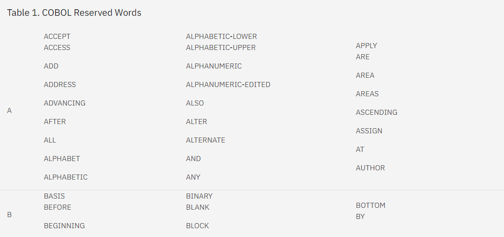
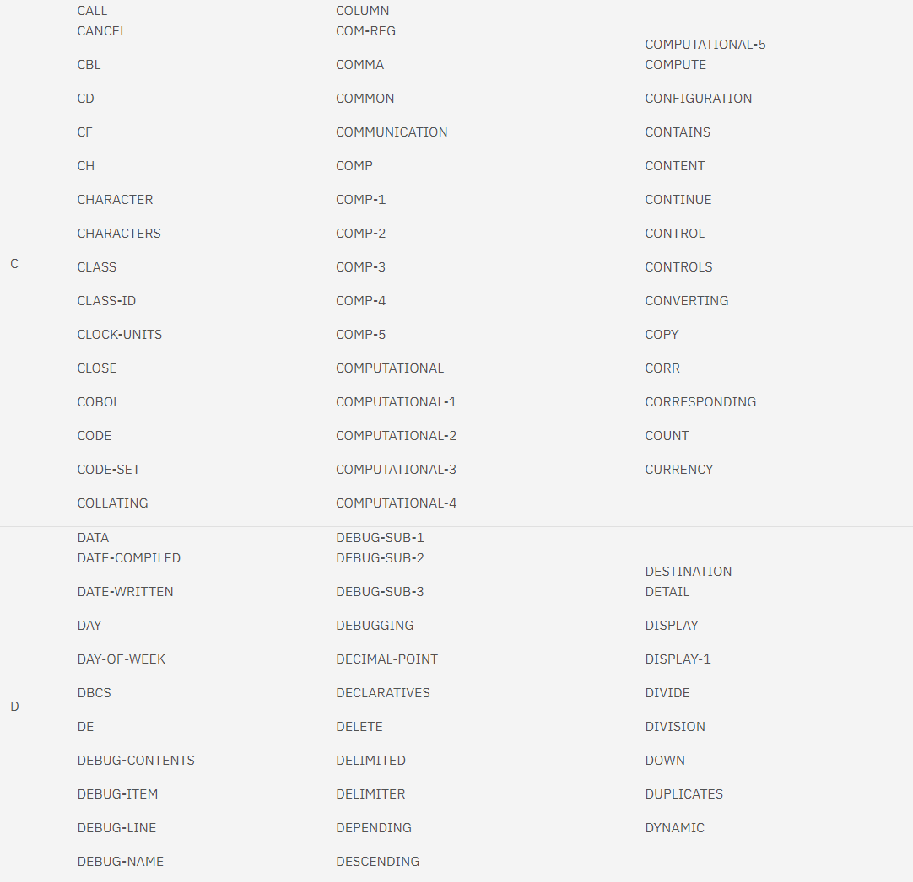
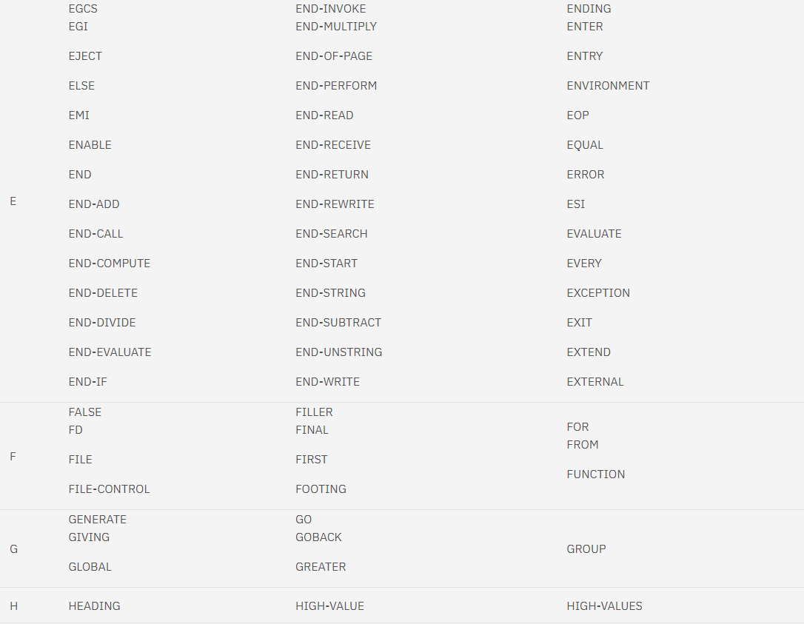
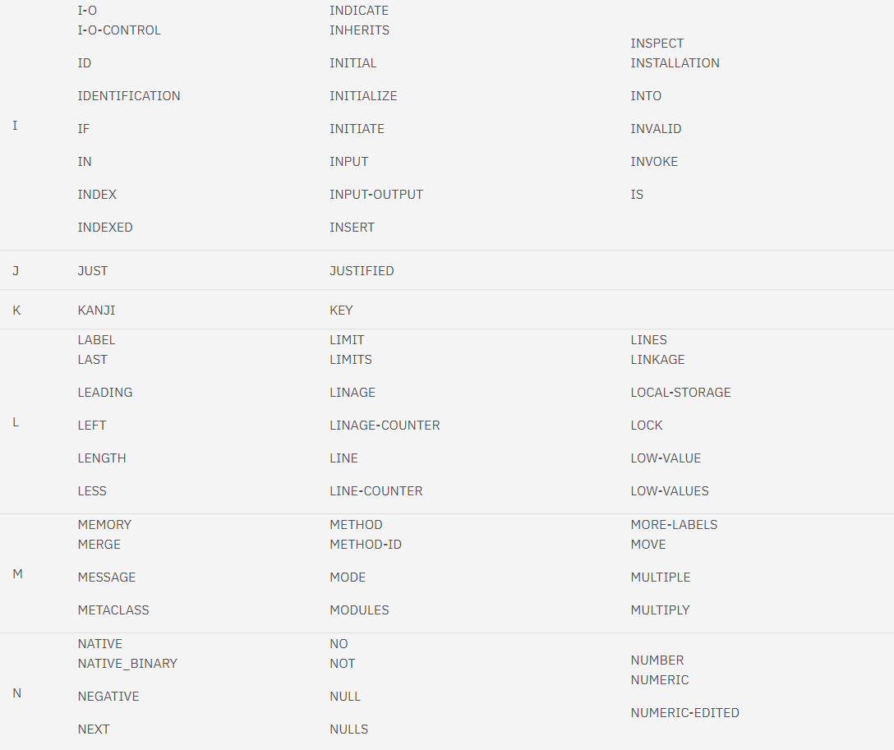
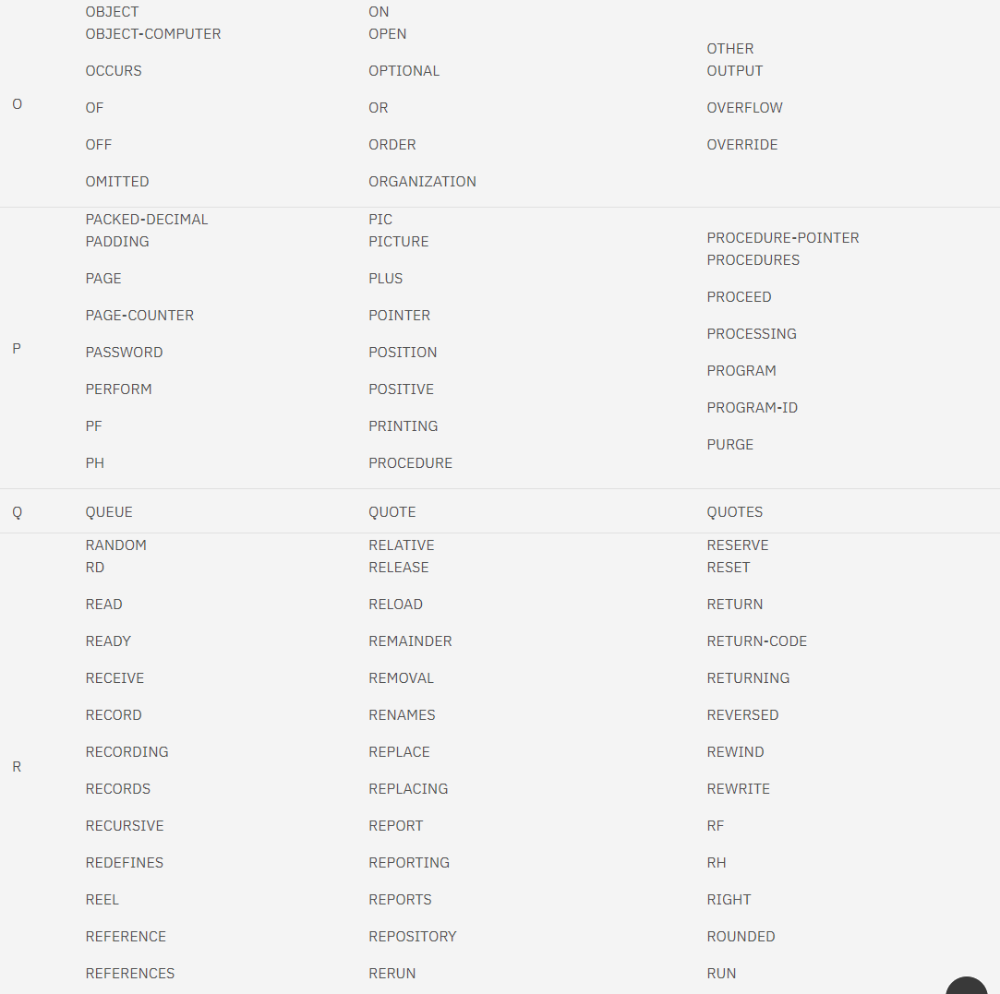
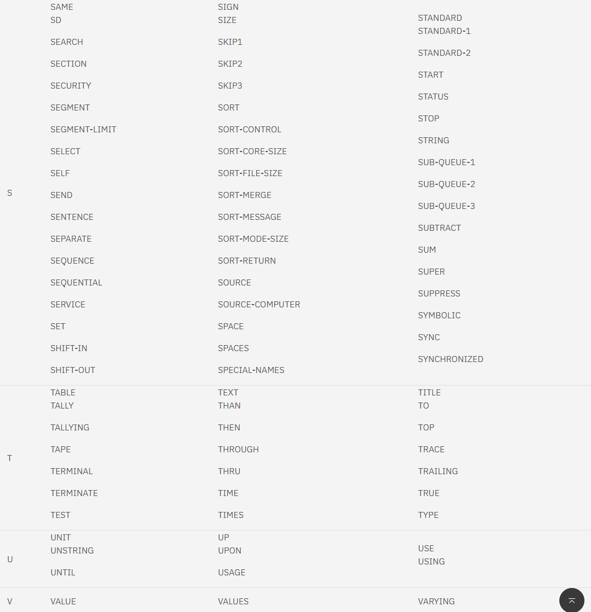
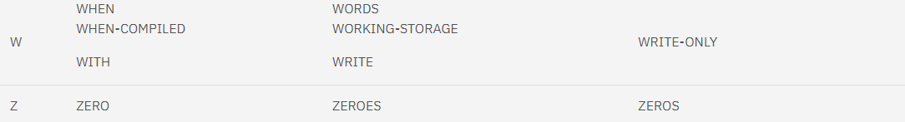

# COBOL
 

## **Historia**

COBOL es un lenguaje diseñado en 1959 por CODASYL como parte del esfuerzo del Departamenteo Americano de Defensa en crear un lenguaje de programación para el procesamiento de datos que fuera portable y se pudiera adaptar a todo tipo de mercados. A pesar de ser un lenguaje de programación bastante antiguo, sigue siendo utilizado hoy día como parte del entorno de la banca.  
 

## **Tipo de Lenguaje y Palabras Reservadas**

COBOL es un lenguaje compilado, lo que significa que cuando se tiene que ejecutar el código, el compilador se encargará de comprobar que el código está correctamente diseñado, y si no es así, dará error. Además, COBOL no es sensible a mayúsculas, lo que quiere decir que se puede escribir con las normas de capitalización que uno quiera.

 

## **Palabras clave**

COBOL cuenta con una gran cantidad de palabras reservadas, como podrían ser:
 
 

Como se puede ver, es una lista de palabras reservadas bastante grande.

 

## **Remuneración** 

En España, el sueldo de un programador de COBOL es de 23,847€ anuales.

 

## **Comunidad**

La representación de la comunidad de COBOL está presente en el entorno de trabajo, por lo que no cuenta con una comunidad muy grande en la red. Hay mas de **un millón* de programadores de COBOL en el mundo.

 

## **Influencias de otros lenguajes**

COBOL fue basado en parte en el lenguaje de programación FLOW-MATIC, desarrollado por Grace Hopper.

 

## **Multiplataforma**

COBOL es multiplataforma, siendo que puede ser ejecutado en mainframes de IBM, unix, windows etc...
